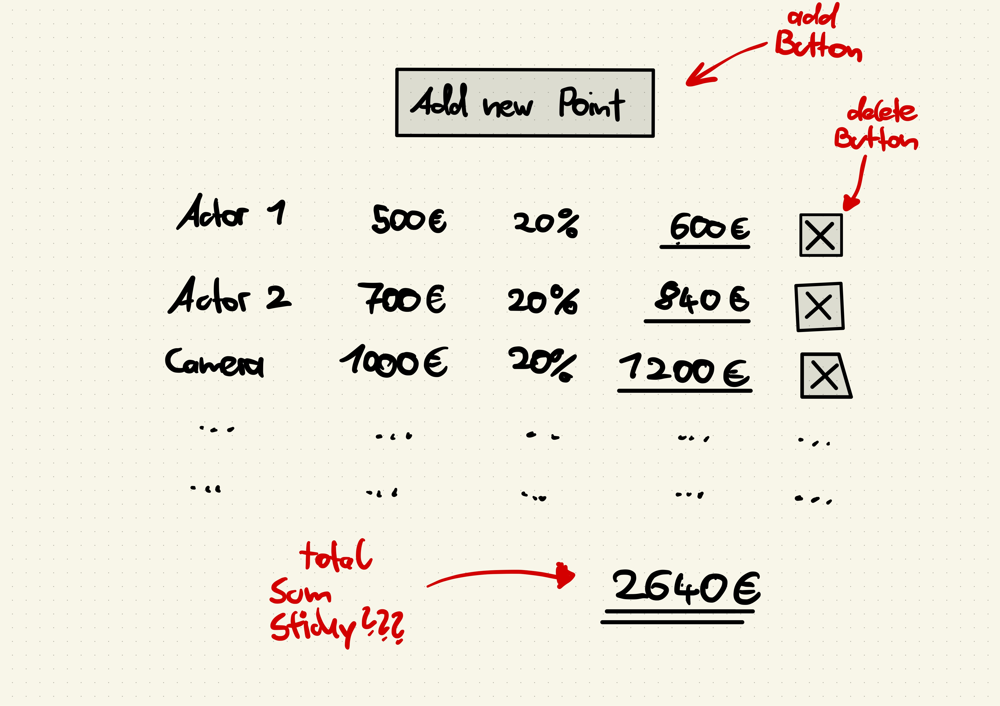

# Cinema Calc Coding Challenge

We created this challenge to learn more about your skills and strengths. It should take you around **3 to 5 hours** to complete it.

## 💼 The Setting

When producers plan their films, they have to think about all required **expenses** and how much they have to spend in the end. Sometimes there will be over 100 expenses that all have to be added together. Each expense consists of **four values**:
1. A **name** which describes the expense (example: „Actor 1“)
2. A **price** for the expense (example: „500,00 €“)
3. A **percentage markup** for the price, usually used to factor in required taxes (example: „20,00 %“)
4. The **total price**  for the expense

## 🧮 Calculation

The **total price for an expense** will be then calculated in the following way:
```
expense total price = price + (price * percentage markup)
```

The total price for our example values could be calculated like this:
```
500,00 € + (500,00 € * 0,20) = 600,00 €
```

All total prices of each expense added together result in the **total price of the calculation**.

## 🧠 The General Task

The general task is to create a **simple web application project** that is able to do the following:

1. Displays a **list** of expenses
3. Each expense has to show its **calculated total price**
2. Each expense has an editable **name, price and percentage markup field**
4. It should be possible to **add** new expenses (they do not need to be populated directly after creation)
5. Below the list of expenses the **sum of all expense total prices** should be visible (This is the total price of the calculation)
6. The expenses have to be stored **persistently** in a **database**

## ✅ Must Haves

- For the frontend use **React** with **JavaScript** or **TypeScript**
- For the backend use **.NET with C#** with a database of your choice
- Create a clean but usable user interface
- Choose a suitable approach to perform **precise price calculations**
- Add an english **readme** file and answer the following questions in there:
  1. How to run the project **locally**?
  2. What is the overall **structure** of your code?
  3. How do you manage **state** in your application? Why did you choose this solution?
  4. How does your approach for **precise number calculations** work?
  5. What „tasks“ did you have on your mind? How did you break down the different deliverables?
  7. Use the readme as a notepad to make us understand your thinking.
- Push the code to **GitHub** or **GitLab**

## ⁉️ Nice To Have

- Make it responsive and mobile friendly
- Adding ability to delete single calculation points
- Use additional libraries if needed

## ❌ No Go‘s / Not Necessary

- You do not have to write tests
- There is not authentication for the web app or the backend endpoints required

## 🖼️ User interface 
Here is a rough sketch on how the interface **could** look like. Please feel free to change and adjust it to make this more usable.



## ⌛️ Deadline

Please send us your solution until **29.09.2024 23:59**.

## ❓ Additional questions

If you have additional questions, or you are stuck, please reach out to [David and Matthias](mailto:david@cinemacalc.com,matthias@cinemacalc.com).

## ✅ After you completed your challenge
Send us an email or message on „Join“ which includes a link to your project or repository.

After that we will review the code and will invite you to a second meeting in which you can showcase your solution.

## 🚀 Good luck!


